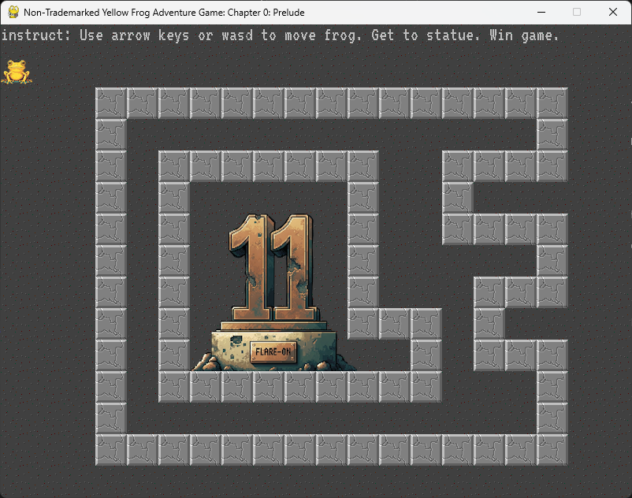
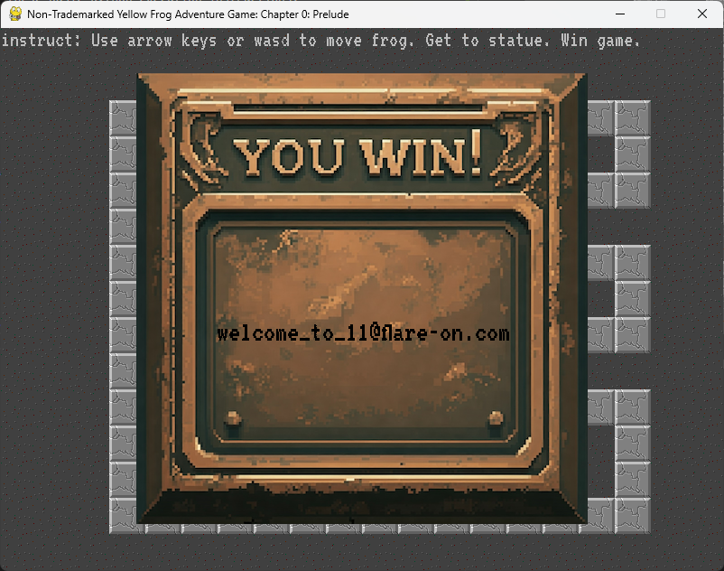
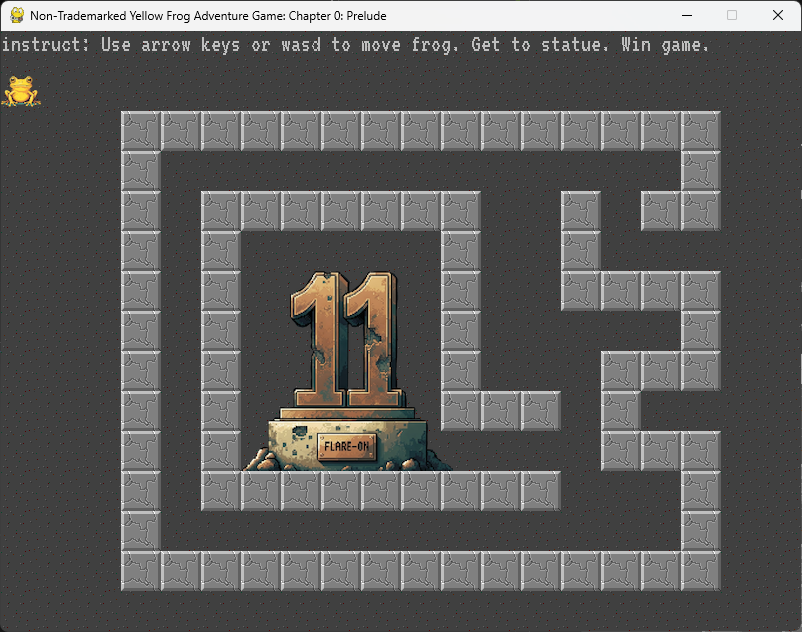

# 1 - frog

## Description
Welcome to Flare-On 11! Download this 7zip package, unzip it with the password 'flare', and read the README.txt file for launching instructions. It is written in PyGame so it may be runnable under many architectures, but also includes a pyinstaller created EXE file for easy execution on Windows.

Your mission is get the frog to the "11" statue, and the game will display the flag. Enter the flag on this page to advance to the next stage. All flags in this event are formatted as email addresses ending with the @flare-on.com domain.

## Task files:
### 1. README.txt
```
This game about a frog is written in PyGame. The source code is provided, as well as a runnable pyinstaller EXE file.

To launch the game run frog.exe on a Windows computer. Otherwise, follow these basic python execution instructions:

1. Install Python 3
2. Install PyGame ("pip install pygame")
3. Run frog: "python frog.py"
```

### 2. frog.exe
### 3. frog.py
### 4. fonts/SIL Open Font License.txt and fonts/VT323-Regular.ttf
### 5. img/win.png, img/floor.png, frog.png, f11_statue.png and block.png

## Solution
There are several ways to approach this challenge. We will demonstrate a few methods that came to mind:

**The lazy approach**: We begin by launching the game, where the following screen appears:



With a bit of intuition, we suspect that some of the walls may not be solid and can be bypassed. After testing each block, we discover that two of them can be traversed, revealing the flag behind them.



**The smart approach**: We inspect the source code and notice that each block has an attribute indicating whether it is solid or passable. While all blocks are drawn by default, only those with ```passable = False``` are actual barriers. We modify the code to draw only the solid blocks as follows: 
```python
for block in blocks:
    if block.passable == False:
        block.draw(screen)
```

After implementing these changes, we relaunch the game, and the clear path to the flag is visible.



**The messy approach**: While analyzing the source code further, we find a function that generates the flag, but it’s encrypted:
```python
def GenerateFlagText(x, y):
    key = x + y*20
    encoded = "\xa5\xb7\xbe\xb1\xbd\xbf\xb7\x8d\xa6\xbd\x8d\xe3\xe3\x92\xb4\xbe\xb3\xa0\xb7\xff\xbd\xbc\xfc\xb1\xbd\xbf"
    return ''.join([chr(ord(c) ^ key) for c in encoded])
```
The flag is dependent on the ```x``` and ```y``` coordinates where the frog reaches the center of the map. Our plan is to brute-force all possible ```x``` and ```y``` values (within a range of 20) and look for readable output.
```python
for i in range(1, 20):
    for j in range(1, 20):
        print(GenerateFlagText(i, j))
```

Running this script will generate some messy outputs. By using ```CTRL+F``` and knowing that the flag format is ```something@flare-on.com```, we can quickly identify the correct flag.


These are just three quick methods to solve the challenge, but there are many more. For instance, we could delete all blocks from the source code or modify the start position of the frog to be directly at the center.

## Flag
```
welcome_to_11@flare-on.com
```
